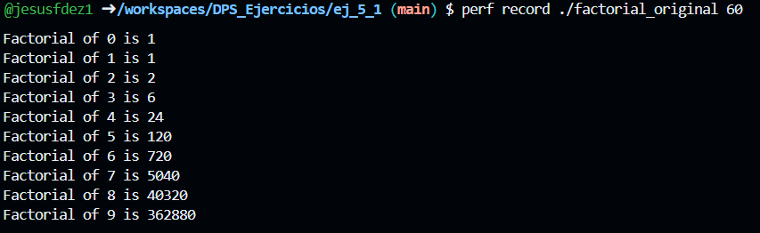
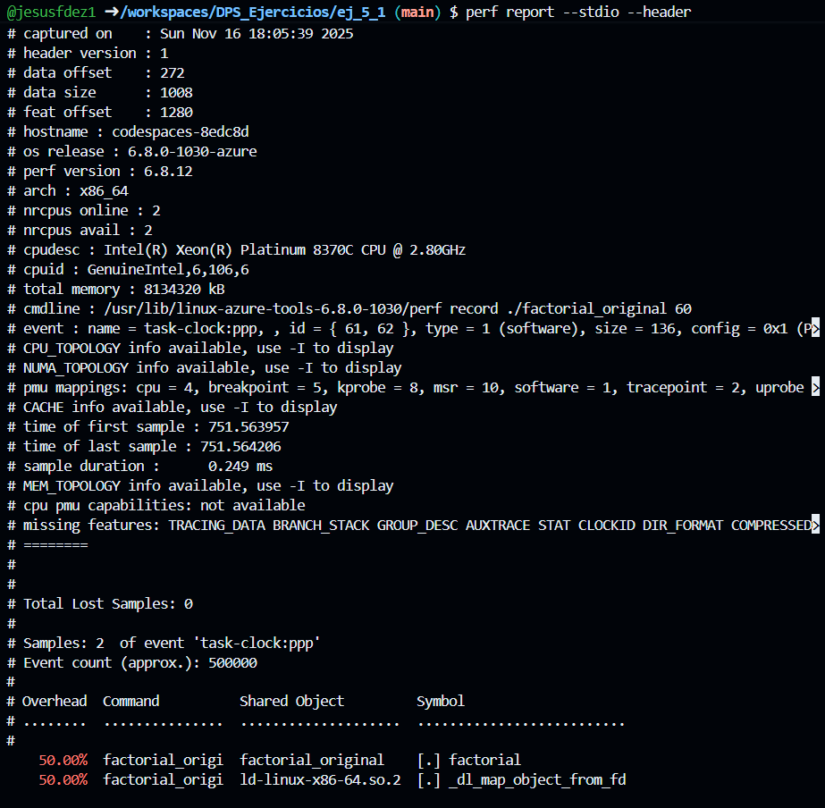
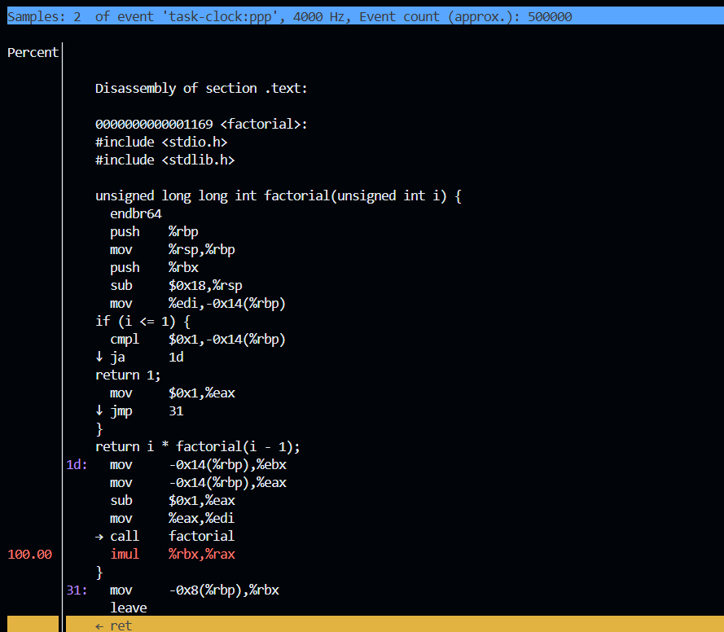

# Ejercicio 5.1 

## 1. ¿Qué hace el siguiente segmento de código?

Este código calcula factoriales de números enteros de forma recursiva. En concreto el programa:
- Define una función `factorial()` que calcula el factorial de un número usando recursividad
- En `main()`, si no se proporcionan argumentos, calcula el factorial de 12
- Si se proporciona un argumento, calcula los factoriales desde 0 hasta el valor especificado

## 2. Comenta qué reglas/recomendaciones se están rompiendo aquí. También entran reglas pasadas.

El código original incumple múltiples reglas del estándar SEI CERT C:

### **DCL00-C: Const-qualify immutable objects**

**Línea 4:** Parámetro `unsigned int i`

El parámetro `i` de la función `factorial()` no se modifica dentro de la función, por lo que debería ser `const`. No usar `const` cuando es aplicable reduce las oportunidades de optimización del compilador y hace menos explícito el contrato de la función.

### **DCL01-C: Do not reuse variable names in subscopes**

**Líneas 4 y 12:** Variable `i`

La variable `i` se usa tanto como parámetro en la función `factorial()` (línea 4) como variable local en `main()` (línea 12). Aunque técnicamente están en ámbitos diferentes, esta reutilización puede causar confusión sobre qué variable se está usando en cada contexto, especialmente al depurar o refactorizar.

### **DCL02-C: Use visually distinct identifiers**

**Líneas 12, 18:** Variables `i`, `j`, `f`

Usa identificadores de una sola letra que son visualmente muy similares y no descriptivos. Es fácil confundirlos, especialmente con fuentes donde `i`, `j`, `l` se parecen, esto hace que aumente el riesgo de errores al escribir o leer el código.

### **DCL04-C: Do not declare more than one variable per declaration**

**Línea 12:** `int i = 12, j = 3, f = 0;`

Declara tres variables en una sola línea. Esto dificulta la lectura del código y aumenta el riesgo de errores. Además, cuando las variables tienen diferentes propósitos (como en este caso), es más confuso.

### **DCL06-C: Use meaningful symbolic constants to represent literal values**

**Líneas 12:** Valores literales `12` y `3`

Usa "números mágicos" (magic numbers) sin explicar su significado. No está claro por qué se eligieron estos valores específicos y hace más difícil cambiarlos si es necesario.


### **DCL19-C: Minimize the scope of variables and functions**

**Línea 12:** `int i = 12, j = 3, f = 0;`

Relacionado con esta regla:
- La inicialización de `j = 3` es innecesaria porque se sobrescribe inmediatamente con `atoi(argv[1])` en el bloque `else`
- La inicialización de `f = 0` es redundante porque se reinicializa en el bucle `for`
- Las variables tienen un ámbito más amplio del necesario

Inicializaciones innecesarias aumentan la confusión, amplían el ámbito de las variables sin razón, y pueden ocultar errores lógicos. Las variables deberían declararse lo más cerca posible de su primer uso.

### **MSC24-C: Do not use deprecated or obsolescent functions**

**Línea 17:** `j = atoi(argv[1]);`

El código usa `atoi()`, que es una función obsoleta porque:
- No detecta errores de conversión
- No tiene forma de indicar si la conversión falló
- Puede causar comportamiento indefinido con entradas inválidas

Usar funciones obsoletas introduce riesgos de seguridad y errores difíciles de detectar. Se debe usar `strtol()` que permite verificar errores de conversión.

### Solución propuesta

Aunque no lo pide explicitamente el enucniado se ha corregido el código aplicando todas las correcciones necesarias:
- **DCL00-C**: El parámetro de `factorial()` se declara como `const`
- **DCL01-C**: No se reutilizan nombres de variables entre ámbitos
- **DCL02-C**: Se usan nombres descriptivos (`default_value`, `max_iterations`, `iteration`, `number`)
- **DCL04-C**: Cada variable se declara en su propia línea
- **DCL06-C**: Se define una constante simbólica `DEFAULT_FACTORIAL_VALUE`
- **DCL19-C**: Las variables se declaran sin inicializaciones innecesarias y con el ámbito mínimo necesario
- **MSC24-C**: Se usa `strtol()` en lugar de la función obsoleta `atoi()`

**Código corregido disponible en:** `answer.c`

## 3. Instala la herramienta perf para realizar el profiling de la aplicación

Para instalar `perf` en sistemas Linux:

```bash
sudo apt update
sudo apt install linux-tools-common linux-tools-generic
```

En algunos sistemas, puede ser necesario instalar la versión específica del kernel:

```bash
sudo apt install linux-tools-$(uname -r)
```

Para usar `perf` correctamente, compilar con símbolos de depuración y sin optimizaciones:

```bash
gcc -g -O0 -o factorial_original original.c
```

## 4. El programa permite mostrar el código desensamblado de la aplicación

Para ver el código desensamblado, primero ejecutamos el programa con `perf record` y luego usamos `perf annotate` para ver el ensamblador:

```bash
# Paso 1: Grabar el profiling
perf record ./factorial_original 60

# Paso 2: Ver el reporte general
perf report --stdio --header

# Paso 3: Ver el código desensamblado
perf annotate
```

**Ejecución del programa:**



**Reporte de profiling:**



Como se puede observar en el reporte:
- Se capturaron aproximadamente 500,000 eventos
- El 50.00% del overhead corresponde a la función `factorial` 
- El otro 50.00% corresponde a operaciones del sistema (`ld-linux-x86-64.so.2`)

**Código desensamblado:**



El desensamblado muestra la función `factorial` completa en lenguaje ensamblador x86-64, donde se puede ver:
- La gestión del stack frame (`push %rbp`, `mov %rsp,%rbp`)
- La condición de parada (`cmpl $0x1,-0x14(%rbp)`)
- La llamada recursiva (`call factorial`)
- La multiplicación del resultado (`imul %rbx,%rax`)

## 5. ¿Podrías decir cuál es la instrucción que más tiempo de CPU requiere?

Según el análisis con `perf annotate`, la instrucción que más tiempo de CPU requiere es `imul   %rbx,%rax`:

```assembly
1d:    mov    -0x14(%rbp),%ebx    # Cargar el valor de i
       mov    -0x14(%rbp),%eax    # Cargar i de nuevo
       sub    $0x1,%eax            # Restar 1 (para i-1)
       mov    %eax,%edi            # Preparar argumento
       → call factorial            # Llamada recursiva
100.00 imul   %rbx,%rax           # Multiplicar i * factorial(i-1) ← CRÍTICO
```

Esta instrucción muestra un **100.00%** del tiempo de CPU en el perfil, como se puede ver en la captura del apartado 4. Esta instrucción es la más costosa porque:

1. **Operación de multiplicación**: La instrucción `imul` (Integer Multiplication) realiza la multiplicación de dos registros de 64 bits (`%rbx` y `%rax`), que es una operación aritmética costosa en términos de ciclos de CPU.

2. **Se ejecuta en cada iteración recursiva**: Esta multiplicación se realiza en cada llamada recursiva de la función `factorial()`, implementando la operación `i * factorial(i - 1)`.

3. **Números grandes**: Al calcular factoriales de números como 60, las multiplicaciones involucran números extremadamente grandes (hasta 64 bits), lo que hace que la operación sea más intensiva.


Hacer una versión iterativa del factorial sería más eficiente porque:
- Evita el overhead de múltiples llamadas recursivas y gestión del stack
- Mantiene las mismas operaciones de multiplicación pero con menos overhead general
- Reduce el uso de memoria del stack